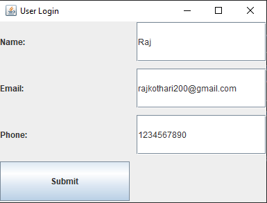
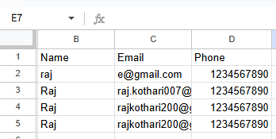
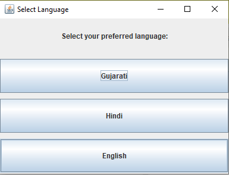
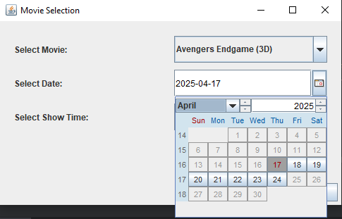
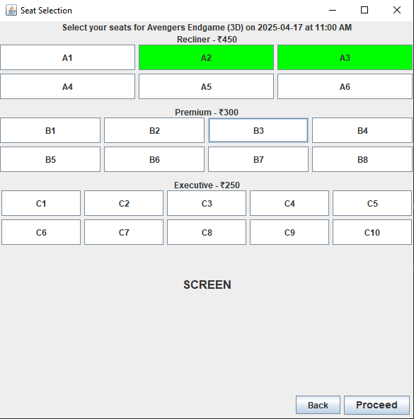
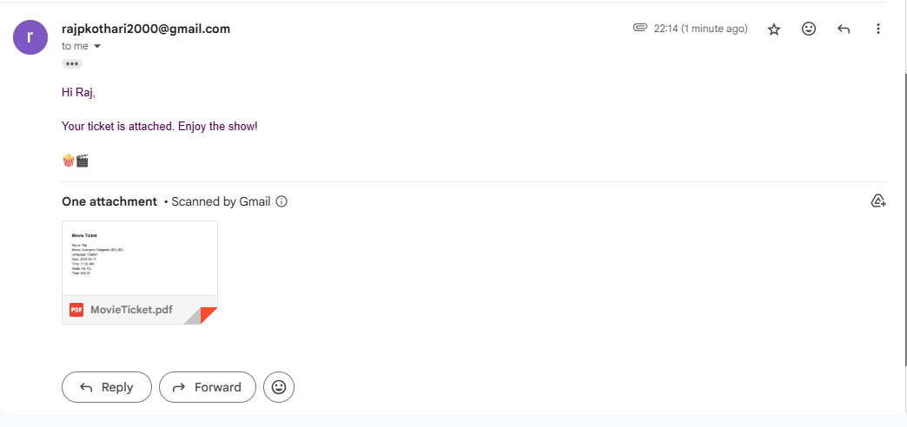
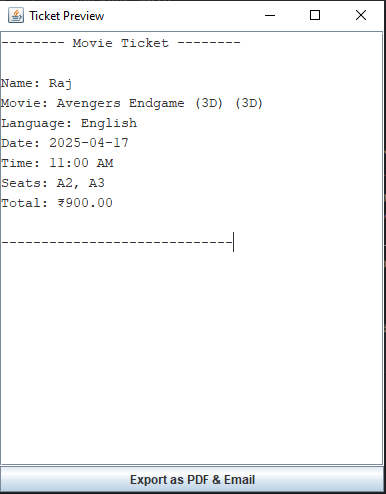
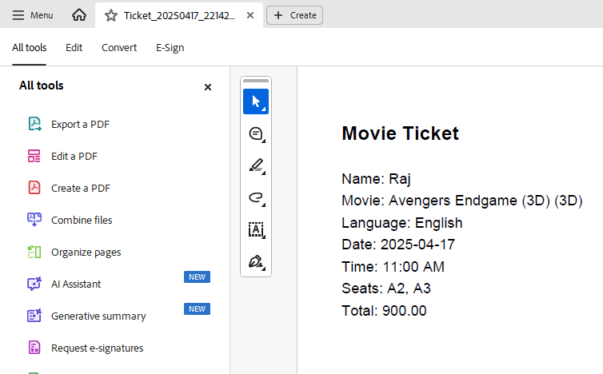
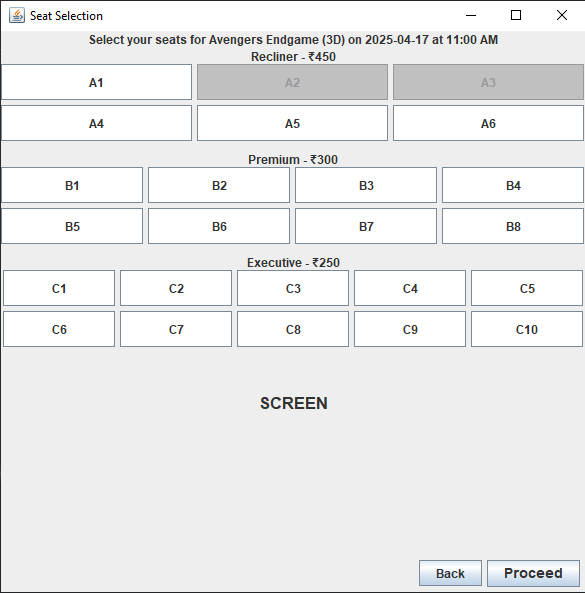
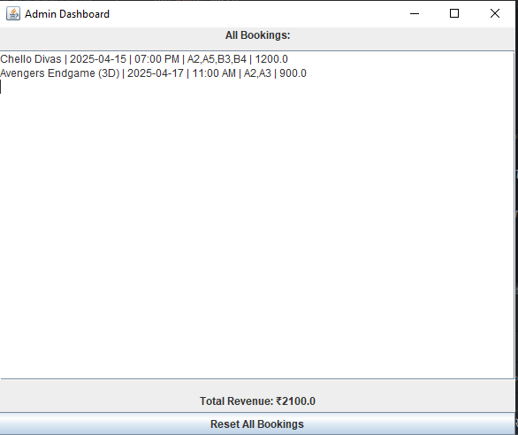

# 🎬 MovieVerse: Java Movie Ticketing System with GUI

A modern Java-based Movie Ticketing System with a Swing-based GUI. It supports multi-language movie listings, flexible booking options, PDF ticket generation, email confirmation, real-time seat locking, and Google Sheets integration via API.

---

## ✨ Features

- ✅ **Real-time Google Sheets Data Storage** (via [SheetDB.io](https://sheetdb.io)) with form validation  
- 🌐 **Language Options**: Hindi, Gujarati, English – 3 movies per language  
- 📅 **Flexible Booking Dates**: Book tickets for up to **7 days** in advance  
- 🎭 **Ticket Categories**:
  - Recliner
  - Premium
  - Executive  
- 🎥 **2D/3D Movie Options**  
- 📧 **Email Ticket Confirmation** to users  
- 📄 **PDF Ticket Download**  
- 🔒 **Seat Locking**: Prevents double bookings  
- 🔐 **Admin Dashboard**: View total tickets sold, revenue earned, and more  

---

## 📦 Libraries Used

| Library                             | Description                            | Download Link |
|-------------------------------------|----------------------------------------|----------------|
| `activation-1.1.1`                  | JavaBeans Activation Framework         | [Download](https://mvnrepository.com/artifact/javax.activation/activation/1.1.1) |
| `apache.httpcomponents`            | Apache HttpClient for HTTP calls       | [Download](https://mvnrepository.com/artifact/org.apache.httpcomponents/httpclient) |
| `google.api.client`                | Google API Client Library              | [Download](https://mvnrepository.com/artifact/com.google.api-client/google-api-client) |
| `google.apis.api.services`         | Google APIs Services                   | [Download](https://mvnrepository.com/artifact/com.google.apis/google-api-services-sheets) |
| `google.oauth.client.jetty`        | OAuth client with Jetty support        | [Download](https://mvnrepository.com/artifact/com.google.oauth-client/google-oauth-client-jetty) |
| `itextpdf-5.5.13.2`                | PDF generation library                 | [Download](https://mvnrepository.com/artifact/com.itextpdf/itextpdf/5.5.13.2) |
| `javax.mail-1.6.2`                 | JavaMail API for sending emails        | [Download](https://mvnrepository.com/artifact/com.sun.mail/javax.mail/1.6.2) |
| `jcalendar-1.4`                    | Calendar date picker for Swing         | [Download](https://mvnrepository.com/artifact/net.sourceforge.jcalendar/jcalendar/1.4) |
| `json`                             | JSON Parsing in Java                   | [Download](https://mvnrepository.com/artifact/org.json/json) |
| `konghq.unirest.java`              | Lightweight HTTP request library       | [Download](https://mvnrepository.com/artifact/com.konghq/unirest-java) |
| `slf4j-nop-1.7.30`                 | No-operation SLF4J binding             | [Download](https://mvnrepository.com/artifact/org.slf4j/slf4j-nop/1.7.30) |
| `slf4j.simple`                     | Simple SLF4J implementation            | [Download](https://mvnrepository.com/artifact/org.slf4j/slf4j-simple) |

---

## 🛠 Tech Stack

- Java Swing (GUI)
- Google Sheets API (via SheetDB)
- iText (PDF)
- JavaMail API
- SLF4J Logging
- Apache HttpClient & Unirest

---

## ℹ️ Important Setup Instructions

**bookings.txt** is where all movie bookings are stored which are displayed on admin dashboard<br>
To enable key features like **Email Confirmation** and **Google Sheets Integration**, follow the steps below:

### 📧 Email Functionality Setup (Gmail App Password)

To send emails from the application, you need to create an **App Password** for your Gmail account:

1. Go to your Google Account: [https://myaccount.google.com/](https://myaccount.google.com/)
2. Navigate to **Security**.
3. Under **"Signing in to Google"**, make sure **2-Step Verification** is turned ON.
4. After enabling 2-Step Verification, go to the **App passwords** section.
5. Select:
   - **App**: "Mail"
   - **Device**: "Other" → Name it anything (e.g., "MovieVerse App")
6. Click **Generate** and copy the 16-character app password.
7. In the code, replace the placeholders with your email and the generated app password.

```java
final String senderEmail = "your_email@gmail.com"; // your email ID
final String appPassword = "your_app_password";  // generated app password
```
---

### 🧾 Google Sheets Integration via SheetDB

To connect your application to a live Google Sheet:

1. Create a new **Google Sheets** document with the required structure.
2. Go to [SheetDB.io](https://sheetdb.io).
3. Sign in and click **"Connect a Google Sheet"**.
4. Authorize your Google account and select the sheet you created.
5. SheetDB will generate an **API URL** (e.g., `https://sheetdb.io/api/v1/abc123`).
6. In your Java code, replace the placeholder with your actual API URL:

```java
private static final String SHEETDB_URL = "https://sheetdb.io/api/v1/your_generated_id";
```

---

## 🖥️ Software Used

**IntelliJ IDEA Ultimate** – Primary IDE for development, offering powerful code analysis, UI designer for Swing, and seamless integration with build tools and version control.

---

## 📸 Output Screenshots

### ✅ Real-time Google Sheets Data Storage (via SheetDB.io) with form validation



### 🌐 Language Options: Hindi, Gujarati, English – 3 movies per language


### 📅 Flexible Booking Dates: Book tickets for up to 7 days in advance


### 🎭 Ticket Categories: Recliner, Premium, Executive


### 📧 Email Ticket Confirmation to users


### 📄 PDF Ticket Download



### 🔒 Seat Locking: Prevents double bookings


### 🔐 Admin Dashboard: View total tickets sold, revenue earned, and more


